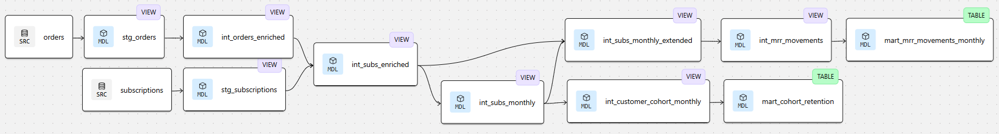

# SaaS MRR Analytics – Junior Analytics Engineer Case Study

## Overview
Data pipeline and dashboard built to calculate MRR Movements 
and MRR Cohort Retention for a B2B SaaS business.

## Stack
- **Warehouse:** BigQuery
- **Transformation:** dbt
- **Visualization:** Looker Studio

## Project Structure
- `/analyses` – exploratory SQL queries on raw data
- `/models/staging` – raw data cleaning and JSON parsing
- `/models/intermediate` – enrichment, joins, and core transformations
- `/models/mart` – final aggregated output models

## Output
- [mart_mrr_movements_monthly](output/mart_mrr_movements_monthly.csv) - MRR Movements by calendar month 
- [mart_cohort_retention](output/mart_cohort_retention.csv) – MRR cohort retention by lifetime month (absolute EUR amount and percentage of MRR in Month 0)

## Dashboard
[Link to Looker Studio dashboard](https://lookerstudio.google.com/reporting/9f4fcd31-b4ec-46b2-8de6-87387e44ddc7)

## Data Lineage

## Documentation
[Short documentation](documentation.pdf)
